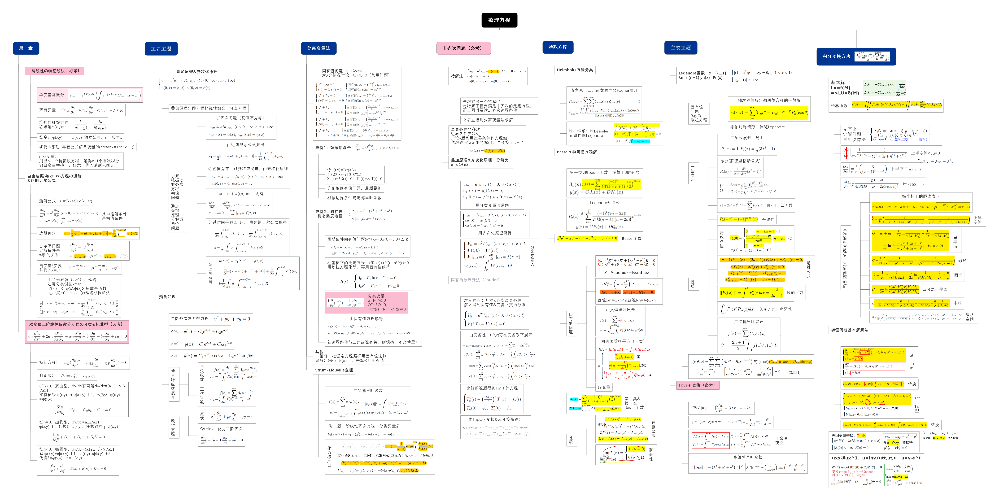
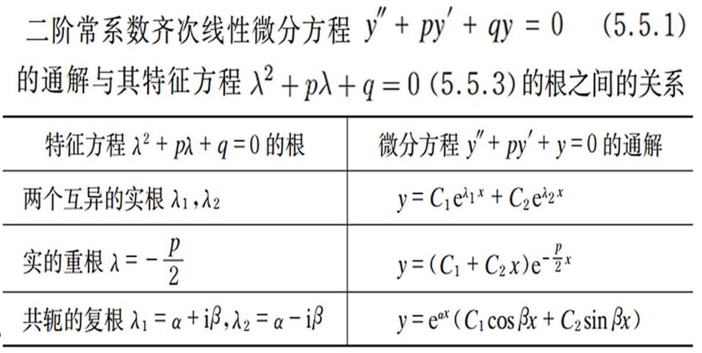
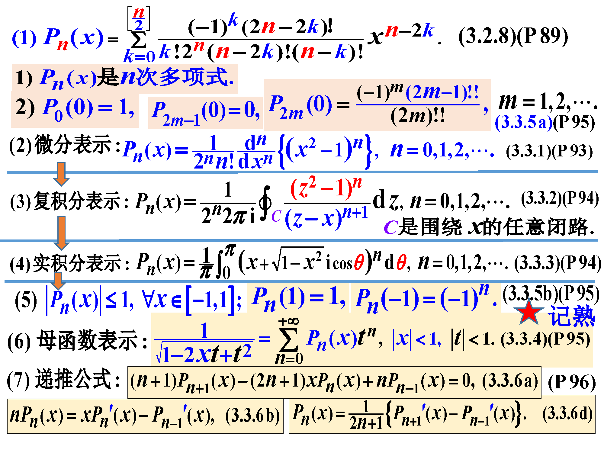

# 数理方程重点



## 偏微分方程

是指含有**多元**未知函数$u=u(\vec x),\vec x=(x_0,x_1,x_2,...,x_n)$及其若干阶偏导数的关系式

$F(\vec x,u,\frac{\partial u}{\partial x_0},\frac{\partial u}{\partial x_1},...,\frac{\partial u}{\partial x_n},...,\frac{\partial^m u}{\partial x_0^{m_0}x_1^{m_1}...x_n^{m_n}})=0\\$

其中$m$为方程的阶，称为偏微分方程，简称为数学物理方程($PDE$)

### 波动方程

> 由**受力分析**+泰勒展开+$\vec F=m\vec a,T=kds,\frac{T_u}{T_x}=\frac{\partial u}{\partial x}$

得到波动方程的形式

$\frac{\partial^2u(t,\vec x)}{\partial^2t}=a^2\Delta u(t,\vec x)+f(t,\vec x)\\$

常数$a $:波的传波速度；$f( t, x)$:单位质量弦所受外力

应用：弹性细杆的纵振动；弹性膜的横振动；声波在空气中传播

可能错的地方：$\Delta u(t,\vec x)$错写成$\nabla T(t,\vec x)$

### 热传导方程

> 由$Q_增=Q_{外入}+Q_{供给}$其中$Q_{增}=cm\Delta u$比热容公式；$\vec Q_n=-\kappa\frac{\partial u(x,y,z)}{\partial n}\vec n$单位时间内沿某方向的热量与温度沿此方向的减少率成正比；供给$g(t,x,y,z)$为单位时间单位体积释放热量

得到热传导方程形式

$\frac{\partial u(t,\vec x)}{\partial t}=a^2\Delta u(t,\vec x)+f(t,\vec x)\\$

常数$a =\frac{\kappa}{c\rho}$；$f( t, x)=\frac{g(t,x,y,z)}{c\rho}$

### 求解

通解：$m$阶偏微分方程的含有$m$个任意函数的解         $C^{m-1}(\mathbb R^{n-1})$

特解：泛定方程需要初始条件，边界条件

1. 初始条件：初始时刻每一点构成的函数，个数：关于$t$的最高导数的阶数
2. 边界条件：固定边界点随时间的函数(|、||、|||类边界条件和|、||、|||类齐次边界条件)   $PPT \ 1.2\ P12$

注意：

1. 解偏微分方程时，每次等式两边关于某一个变量（比如$x$）积分后，$0$关于$x$积分后得到一个不依赖该变量$x$，但是依赖除此变量$x$外所有剩余的变量的任意函数

2. $45$页$4(2)$

   ```text
   两边乘以积分因子再化成全微分
   ```

3. 线性方程的定义？

### 二元一阶线性$PDE$

$u=u(x,y),a(x,y)\frac{\partial u}{\partial x}+b(x,y)\frac{\partial u}{\partial y}+c(x,y)u=f(x,y),ab\neq0\\$

$thought$：积分因子法$45$页$4(2)$

$tools$：变量代换，链式法则

$important$：特征方程$\frac{dx}{a(x,y)}=\frac{dy}{b(x,y)}$    $G\in C^{1}(\mathbb R)$

$hard$：链式法则，寻找一个合适的$\eta$

### 多元一阶线性$PDE$

写特征方程，找到$\xi_i,i\neq n$后先化简为$D(\vec\xi)\frac{\partial u}{\partial \xi_n}+c(\vec\xi)u=f(\vec\xi)\\$，$D为\xi_n$代入原方程对原变量偏导的系数

### 二元二阶线性$PDE$

$thought\ 1 $：二阶可因式分解变一阶

最基本的方法：`令v=u的微分方程或u的函数`

$e.g.\quad\frac{\partial^2u}{\partial x\partial y}+y\frac{\partial u}{\partial x}=2xy$

- **无界区域**二元二阶==齐次==波动方程初值问题：达朗贝尔公式

- **半区域**二元二阶==齐次==波动方程初值问题，构造函数分情况讨论
  
  - |类边界条件，奇延拓
  - ||类边界条件，偶延拓
  - 四元二阶波动方程(化为二元)球面波$v=ru$`注意与P45T2,3的区别`
  
- $Goursat$**特征边值**问题

- **无界区域**二元二阶==非齐次==波动方程初值问题

  线性叠加原理（有限叠加+积分叠加）+达朗贝尔公式+$u_2=\int_0^tw(t,x,\tau)d\tau$

- **有界区域**==齐次(周期)边条==二元二阶==齐次==线性方程
  
  - 波动方程初值问题：(边值条件齐次)分离变量法
  
    满足$S-L$定理有**非负**的固有值，当给出不含|、|||类边界条件时注意$\textcolor{red}{\lambda=0}$的情况！
  
    叠加后再代入初始条件！
  
  - $Laplace$方程：$\Delta_2u(r,\theta)=0$，
  
    圆域问题 $\Theta$满足周期条件+
  
    $u=\frac{C_0+D_0lnr}{2}+\sum_{n=1}^\infty (C_{1n}r^n+D_{1n}r^{-n})cos(n\theta)+\sum_{n=1}^\infty (C_{2n}r^n+D_{2n}r^{-n})sin(n\theta)\quad 0<a<r<b<+\infty\\$
  
- **有界区域**==齐次(周期)边条==二元二阶==非齐次==线性方程

  1. 特解法：适用于非齐次项为一元函数，化为常微分方程的边值问题求出特解
  
  2. 冲量原理（含时）：==注意把$t$换成$t'=t-\tau$，$t$换成$\tau$==
  
  3. Fourier展开：thought：将$u(t,x),f(t,x),\varphi(x),\psi(x)$化为$L^2_\rho[a,b]$空间中的向量，对比系数
  
     对每个基都可以得到关于非固有值变量的常微分方程和边界条件
  
     当变量为$(\theta,r)$时对具体基代具体n
  
  $Poisson$(场位)方程：$0=\Delta u(t,\vec x)+f(t,\vec x)\\$只能用1,3两种方法
  
- **有界区域**==非齐次边条==二元二阶==非齐次==线性方程（见P45）

  1. 化为齐次边条
  2. 退化回上一问题

------

$thought\ 2$：利用特征方程(不可因式分解降阶的，齐次的)

一般形式：$a_{11}\frac{\partial^2 u}{\partial x^2}+\textcolor{red}{2}a_{12}\frac{\partial^2 u}{\partial x\partial y}+a_{22}\frac{\partial^2 u}{\partial y^2}+b_1\frac{\partial u}{\partial x}+b_2\frac{\partial u}{\partial y}+cu=0\quad xy\neq0\\$

1. 判断$\Delta=a^2_{12}-a_{11}a_{22}$确定类型（大于0双曲，等于0抛物，小于0椭圆）
2. 特征方程$a_{11}\textcolor{red}{(dy)^2}\textcolor{red}{-2a_{12}}dxdy+a_{22}(dx)^2=0$
3. $\begin{cases}\varphi(x,y)\\\eta(x,y)\end{cases}$
4. 链式法则求导

$tips:$抛物标准型关于两个自变量的最高阶偏导阶数不同，双曲标准型二阶只有混合偏导，椭圆标准型关于两个自变量的最高阶偏导阶数相同

### 三元二阶线性$PDE$

- **有界区域**==单/双齐次边条==三元二阶==齐次==线性方程

  求解仅含空间变量的$Helmholtz$方程：$\Delta_3v+k^2v=0$

  - 直角坐标
  
  - 柱坐标：$R$函数满足**$Bessel$方程**（$\lambda=0\to Eular$方程）
  
    $Bessel$方程：$\textcolor{red}{x^2y''+xy'+(x^2-\nu^2)y=0}$
  
  - 球坐标：$\Theta$函数满足**$m$阶连带$Legendre$方程**，$R$函数满足球$Bessel$方程（$k=0\to Eular$方程）
  
    $Legendre$方程：$\textcolor{red}{[(1-x^2)y']'+\lambda y=0}\\$
    
    轴对称解：$u=\sum_{n=0}^\infty(C_nr^n+\frac{D_n}{r^{n+1}})P_n(cosx)\\$

### $Others$

固有值问题：$S-L$标准型？$S-L$定理？目的：1.求$\rho\to$加权内积      2.判断固有值取值（满足S-L定理所有条件）

圆环域内边界$\frac{\part u}{\part n}\bigg|_{r=a}=-\frac{\part u}{\part r}\bigg|_{r=a}\\$

$\lambda=0?n=0?\rho=1?\ \ \quad\frac{2}{区间长度}?\int权?基函数?\\$

求解二阶方程的思路：设多项式$\to$代入方程$\to$合并同类项得递推公式$\to$讨论

$(2m)!\neq2^mm!$

P132T4    P96例3.3.2.    勒让德递推公式会给，$L_{m,n}\triangleq\int_{\textcolor{red}{0}}^1x^mP_n(x)dx,L_{m,n}=\frac{m}{m+n+1}L_{m-1,n-1}\\$
