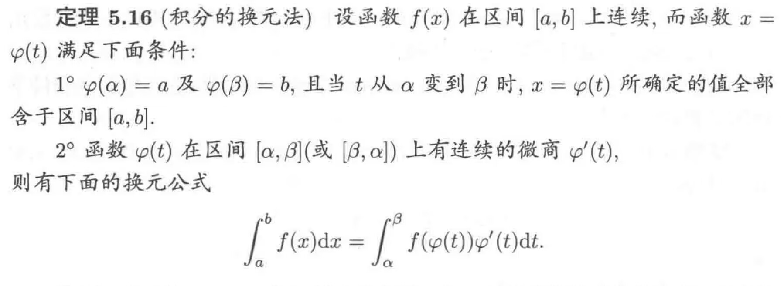

# 数理方程重点

## 偏微分方程

是指含有**多元**未知函数$u=u(\vec x),\vec x=(x_0,x_1,x_2,...,x_n)$及其若干阶偏导数的关系式

$F(\vec x,u,\frac{\partial u}{\partial x_0},\frac{\partial u}{\partial x_1},...,\frac{\partial u}{\partial x_n},...,\frac{\partial^m u}{\partial x_0^{m_0}x_1^{m_1}...x_n^{m_n}})=0\\$

其中$m$为方程的阶，称为偏微分方程，简称为数学物理方程($PDE$)

### 波动方程

> 由**受力分析**+泰勒展开+$\vec F=m\vec a,T=kds,\frac{T_u}{T_x}=\frac{\partial u}{\partial x}$

得到波动方程的形式

$\frac{\partial^2u(t,\vec x)}{\partial^2t}=a^2\Delta u(t,\vec x)+f(t,\vec x)\\$

常数$a $:波的传波速度；$f( t, x)$:单位质量弦所受外力

应用：弹性细杆的纵振动；弹性膜的横振动；声波在空气中传播

可能错的地方：$\Delta u(t,\vec x)$错写成$\nabla T(t,\vec x)$

### 热传导方程

> 由$Q_增=Q_{外入}+Q_{供给}$其中$Q_{增}=cm\Delta u$比热容公式；$\vec Q_n=-\kappa\frac{\partial u(x,y,z)}{\partial n}\vec n$单位时间内沿某方向的热量与温度沿此方向的减少率成正比；供给$g(t,x,y,z)$为单位时间单位体积释放热量

得到热传导方程形式

$\frac{\partial u(t,\vec x)}{\partial t}=a^2\Delta u(t,\vec x)+f(t,\vec x)\\$

常数$a =\frac{\kappa}{c\rho}$；$f( t, x)=\frac{g(t,x,y,z)}{c\rho}$

### 场位方程

> 由高斯公式和斯托克斯公式

$0=\Delta u(t,\vec x)+f(t,\vec x)\\$

$f( t, x)=\frac{\rho(x,y,z)}{\varepsilon_0}$

应用：静电场

### 求解

通解：$m$阶偏微分方程的含有$m$个任意函数的解         $C^{m-1}(\mathbb R^{n-1})$

特解：泛定方程需要初始条件，边界条件

1. 初始条件：初始时刻每一点构成的函数，个数：关于$t$的最高导数的阶数
2. 边界条件：固定边界点随时间的函数(ⅠⅡⅢ类边界条件和ⅠⅡⅢ类齐次边界条件)   $PPT \ 1.2\ P12$

注意：

1. 解偏微分方程时，每次等式两边关于某一个变量（比如$x$）积分后，$0$关于$x$积分后得到一个不依赖该变量$x$，但是依赖除此变量$x$外所有剩余的变量的任意函数

2. $45$页$4(2)$

   ```text
   两边乘以积分因子再化成全微分
   ```

3. 线性方程的定义？

### 二元一阶线性$PDE$

$u=u(x,y),a(x,y)\frac{\partial u}{\partial x}+b(x,y)\frac{\partial u}{\partial y}+c(x,y)u=f(x,y),ab\neq0\\$

$thought$：积分因子法$45$页$4(2)$

$tools$：变量代换，链式法则

$important$：特征方程$\frac{dx}{a(x,y)}=\frac{dy}{b(x,y)}$    $G\in C^{1}(\mathbb R)$

$hard$：寻找一个合适的$\eta$

### 多元一阶线性$PDE$

$D(x,y)\frac{\partial u}{\partial \xi_n}+c(x,y)u=f(x,y)\\$

$D=\xi_n$代入原方程偏导

### 一元二阶波动方程

$thought$：二阶因式分解变一阶

- **无界区域**波动方程初值问题：达朗贝尔公式



- **半区域**波动方程，构造函数分情况讨论
  - Ⅰ类边界条件，奇延拓
  - Ⅱ类边界条件，偶延拓
  - 三维波动方程球面波$v=ru$

- $e.g.\quad\frac{\partial^2u}{\partial x\partial y}+y\frac{\partial u}{\partial x}=2xy$
